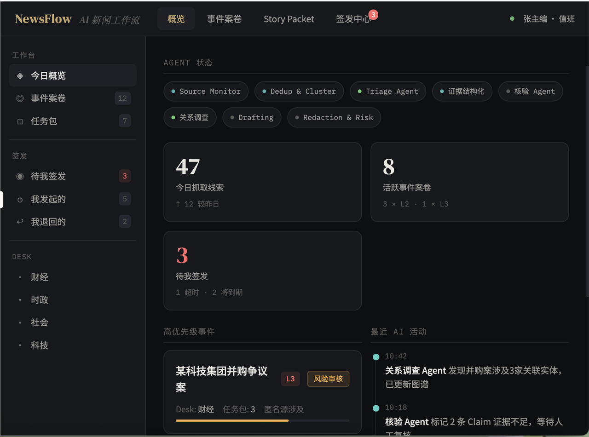

# NewsFlow

[](https://github.com/Yaogui415/newsflow-oss/actions/workflows/ci.yml)
[](./LICENSE)


> AI-assisted newsroom workflow for event tracking, evidence organization, approval chains, correction handling, and post-publication monitoring.

NewsFlow is not just an AI writing tool. It is a newsroom workflow system designed to support the middle of the reporting process: lead intake, event clustering, evidence structuring, claim review, risk checks, sign-off decisions, correction handling, and post-publication follow-up.

中文简介：NewsFlow 不是一个只围绕“自动写稿”的 AI 工具。它更关注新闻生产中真正高成本、也更高责任的中间流程：线索进入、事件归并、证据组织、Claim 结构化、风险暴露、签发审批、勘误流转，以及发布后的监测与知识回写。

## Why this project exists

Most AI products for journalism focus on output: drafting, rewriting, summarizing, or style transfer. NewsFlow focuses on a different problem: the hidden coordination and judgment costs that sit before and after the final text.

It is built around a simple belief:

- the hardest part of responsible news work is often not writing itself
- the real cost sits in organizing evidence, judgment, risk, and handoff across roles
- if AI enters this space, it should make the process more visible and reviewable, not less accountable

## What makes NewsFlow different

| Dimension | General AI writing tools | NewsFlow |
| --------- | ------------------------ | -------- |
| Core object | Text | Events and Story Packets |
| Main task | Generate or rewrite copy | Organize workflow, evidence, and approval |
| Human role | Final editor | Embedded decision-maker at key checkpoints |
| Risk handling | Often left to the end | Brought forward into workflow nodes |
| Post-publication loop | Usually missing | Monitoring, correction, and knowledge write-back |

## Screenshots

### Dashboard



### Workflow and task detail


## Best suited for

- self-hosted product exploration
- newsroom workflow demos and teaching
- full-stack prototype extension
- experiments around human-in-the-loop review, approval traceability, and editorial governance

## Current status

- End-to-end frontend and backend are in place
- Core objects, workflow stages, and key review pages are implemented
- Suitable for self-hosting, demos, and secondary development
- Still closer to a high-fidelity prototype than a production-ready newsroom platform

## Open-source entry points

- `CONTRIBUTING.md` — contribution guide and development expectations
- `SECURITY.md` — responsible disclosure and sensitive-data boundaries
- `CODE_OF_CONDUCT.md` — collaboration expectations for contributors
- `docs/OPEN_SOURCE_GUIDE.md` — GitHub positioning, topics, and publishing checklist
- `docs/GITHUB_ABOUT.md` — ready-to-use repository description and About copy
- `docs/RELEASE_v0.1.0.md` — first public release notes and announcement copy
- `docs/SELF_HOSTING.md` — local and self-hosted setup guide
- `backend/.env.example` — backend environment example
- `frontend/.env.example` — frontend environment example

## Project structure

```text
newsflow/
├── backend/                     # FastAPI backend
│   ├── app/
│   │   ├── agents/             # AI agents by workflow stage
│   │   ├── api/v1/             # REST API endpoints
│   │   ├── core/               # config, database, security, state machine
│   │   ├── models/             # ORM models
│   │   └── services/           # business services
│   ├── migrations/             # Alembic migrations
│   └── tests/                  # backend tests
├── frontend/                    # React + TypeScript frontend
│   └── src/
│       ├── pages/
│       ├── layouts/
│       ├── services/
│       └── stores/
├── docs/                        # open-source and audit documentation
└── image/                       # icon and preview assets
```

## Core agents

| Agent | Responsibility | Stage |
| ----- | -------------- | ----- |
| Source Monitor | Multi-source lead intake and 5W1H extraction | Input |
| Dedup & Cluster | Deduplication and event clustering | Input |
| Triage | Intake review and risk grading | Input |
| Evidence Structuring | Evidence organization and Claim generation | Cognition |
| Relationship Investigation | Relationship mapping and event graph support | Cognition |
| Verification | Multi-source verification and confidence scoring | Cognition |
| Redaction & Risk | Redaction and risk detection | Governance |
| Audit | Audit trail and chain integrity | Governance |
| Drafting | Assisted drafting and structure planning | Production |
| Channel Adaptation | Multi-channel adaptation and drift checks | Production |
| Orchestrator | Workflow orchestration and state management | Control |
| Post-Publish Monitor | Monitoring, correction, and follow-up loop | Closed loop |

## Key capabilities

### Input side

- RSS, API, and manual intake
- deduplication and event clustering
- automatic risk grading
- editor-facing triage suggestions

### Cognition side

- 5W1H extraction
- Claim Card generation
- evidence verification
- relationship mapping

### Governance side

- multi-stage redaction gates
- PII detection
- source-protection boundaries
- traceable audit logs

### Production side

- AI-assisted drafting
- channel adaptation
- semantic drift checks
- platform rule checks

### Approval flow

- state-machine-driven workflow
- multi-stage sign-off
- SLA awareness
- explicit human gates

## Quick start

### Prerequisites

- Python `3.12` or `3.13` recommended for backend setup
- Node.js `20.19+` recommended for frontend setup
- Docker and Docker Compose for local infrastructure

Note: Python `3.14` is not yet recommended here because some native dependencies such as `orjson` may fail to build depending on your environment.

### 1. Start infrastructure

```bash
docker compose up -d
```

### 2. Configure environment variables

- copy `backend/.env.example` to `backend/.env`
- copy `frontend/.env.example` to `frontend/.env.local`

### 3. Start backend

```bash
cd backend
pip install -r requirements.txt
alembic upgrade head
uvicorn app.main:app --reload --port 8000
```

### 4. Start frontend

```bash
cd frontend
npm install
npm run dev
```

### 5. Visit the app

- frontend: `http://localhost:5173`
- health check: `http://localhost:8000/health`
- API docs: `http://localhost:8000/docs`

### 6. Notes

- frontend uses `VITE_API_BASE_URL` to connect to the backend
- login warmup/fallback can also use `VITE_BACKEND_DIRECT_URL` and `VITE_BACKEND_HEALTH_URL`
- default local API URL is `http://localhost:8000/api/v1`
- set `OPENAI_API_KEY` in `backend/.env` if you want to enable LLM-backed features

## API surface

| Path | Description |
| ---- | ----------- |
| `/api/v1/auth` | Authentication and authorization |
| `/api/v1/events` | Event case management |
| `/api/v1/story-packets` | Story Packet management |
| `/api/v1/approvals` | Sign-off and decision flow |
| `/api/v1/sources` | Source intake and upload |
| `/api/v1/dashboard` | Dashboard data |
| `/api/v1/workflows` | Workflow runtime and audit stream |

## Core objects

- `EventCase`
- `StoryPacket`
- `ClaimCard`
- `EvidencePack`
- `DraftVersion`
- `ChannelPackage`
- `ReviewBundle`
- `ApprovalTask`
- `DecisionLog`
- `SourceVault`
- `RiskReport`
- `CorrectionTicket`
- `AuditLog`

## Tech stack

### Backend

- FastAPI
- SQLAlchemy + Alembic
- aiosqlite / asyncpg
- LangChain Core
- Gunicorn + Uvicorn

### Frontend

- React 18
- TypeScript
- Ant Design 5
- React Router 6
- Vite
- Zustand

### AI / LLM

- OpenAI GPT-4o / GPT-4o-mini
- LangChain OpenAI

## Roadmap

- [x] core object model and state machine
- [x] multi-stage agents across input, cognition, governance, and production
- [x] sign-off center and human override support
- [x] post-publication monitoring and correction loop
- [x] open-source packaging and self-hosting setup
- [x] more complete self-hosting docs
- [ ] finer-grained evidence anchors and citation mapping
- [ ] stronger permissions, metrics, and long-term memory governance

## Related docs

- `docs/AUDIT_FINDINGS.md` — audit findings across backend, frontend, and integration
- `docs/OPEN_SOURCE_GUIDE.md` — open-source packaging notes
- `docs/GITHUB_ABOUT.md` — repository description and public-facing copy
- `docs/RELEASE_v0.1.0.md` — first public release notes
- `docs/GITHUB_PAGE_SETUP.md` — final GitHub page copy and launch checklist
- `docs/PUBLICATION_AUDIT.md` — public-release scope and sensitive-info audit
- `docs/SELF_HOSTING.md` — self-hosting and deployment guidance

## Maintainer notes

If you want this repository to feel complete on GitHub, the next good steps are:

- upload `image/newsflow-social-preview.svg` as the GitHub social preview image
- copy the text from `docs/GITHUB_ABOUT.md` into the repository About section
- publish a first Release using `docs/RELEASE_v0.1.0.md`
- follow `docs/REPO_MAINTENANCE_CHECKLIST.md` for branch protection, issue hygiene, and release upkeep

## License

This project is released under the [MIT License](./LICENSE).
